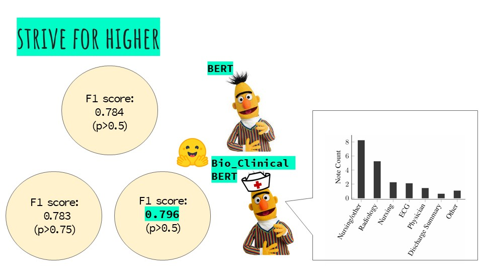

  

Are you familiar with the stressful final exams in medicine in which there is an actor impersonating a patient, and the student has to diagnose him? So on the diagnostic form registered by the student we conducted the [competition](https://www.kaggle.com/competitions/nbme-score-clinical-patient-notes/data).

The purpose of the competition is to develop a model that automatically reads the diagnostic forms and score students performance according to their ability to question and expose as many symptoms as possible.

A solution to a problem as presented in the competition can expedite appointments with the family doctor as well as in the intensive care unit. Instead of typing everything manually into a computer and dealing with referring to a relevant department and looking for medications, the doctor can use a tool that converts speech to text, then extract the medical terms and direct the patient to the relevant departments accoding to the detected symptoms, as well as to appropriate drugs.
  

  

How is it done?
The competition contained freewriting diagnostic summaries of 1000 students, each examined on a different medical case (a total of 10 completely different medical cases from each other: one sexually transmitted diseases, the other thyroid problems, etc.). In each medical case there were about 14 hidden symptoms that the student had to identify (most of them identified only about 70% of them, i.e. about 10). Hence the training dataset contains about 10,000 (1000X10) rows. Each row includes the student's diagnostic text, the symptoms which were required to detect, and a location which indicates where symptom's text is found in the diagnostic summeary (start letter and end letter) [NBME_EDA.ipynb](https://github.com/RotemHonPauker/NBME_score_clinical_patient_notes/blob/master/NBME_EDA.ipynb).

  

The dataset is not simple at all for a "generic" language model! First, it contains a lot of medical terms, abbreviations that are not common in our everyday language, which the generic models "speak" since thwy have learned to speak through reading thousands of Wikipedia pages. Secondly, the data is "noisy", meaning that the person who tagged the data and marked where each symptom is found in the diagnostic text did not do his job faithfully. The last problem is that the dataset is not diverse, it contains a total of 10 cases, hence the model could tend to overfitting and link unrelated symptoms.

  

The modeling work: The profoung knowledge about transformers and different types of challenges in the field of NLP, led us to realize that the problem can be modeled as a Question-Answering problem.
 
The models' preformances are measured by a micro-F1-score, which tests for each row in the dataset (regardless of the symptom type or the patient type) whether we identified all the words in the text that were relevant to the same symptom as tagged by the taggers (by start letter and end letter). With the kind help of a few Kagglers, the model were wraped with a code that correctly describes the measure. Firsly a "generic" BERT model was trained [NBME_bert.ipynb](https://github.com/RotemHonPauker/NBME_score_clinical_patient_notes/blob/master/NBME_bert.ipynb). (The predictions of the model are saved in a pkl file which can be found in the output of our [BERT kaggle notebook](https://www.kaggle.com/code/rotemhon/nbme-bert/data)).

  

The BERT outputs (before the sigmoid executed) are shown above. The x axis indicates the tokens' location (which is called Offset mapping) and the y axis indicates the level of the prediction certainity that this token is classified to the current symptom. Visualizations can be found [here](https://github.com/RotemHonPauker/NBME_score_clinical_patient_notes/blob/master/NBME_visualization.ipynb). 

  

Based on the initial assumption that the generic BERT model has a difficulty dealing with medical terms, the domain specific Bio_Clinical_BERT model was also trained [NBME_bio_clinical_bert.ipynb](https://github.com/RotemHonPauker/NBME_score_clinical_patient_notes/blob/master/NBME_bio_clinical_bert.ipynb). This model pretrained by MIMIC-III database which contains medical records of patients in the intesive care unit at Beit Israel Hospital in Boston.(The predictions of the model are saved in a pkl file which can be found in the output of our [Bio_Clinical_BERT kaggle notebook](https://www.kaggle.com/code/kerenhalevy/nmbe-bio-medical-bert/data)).

  

Happily, improved scores were obtained, however surprising results were obsserved also. Both the medical model non-medical model linked unexpected symptoms. Is this due to their "prior knowledge" from Wikipedia and the intensive care unit, or is it a result of predicted overfitting? We tend to the second answer, but this requires further examination.

This interesting noisy data has led us to territories out of the sccope of this competition, including performing a [clustering](https://github.com/RotemHonPauker/NBME_score_clinical_patient_notes/blob/master/NBME_clustering.ipynb) on the symptoms' titles, but good results have not yet been achieved. To be continued...
